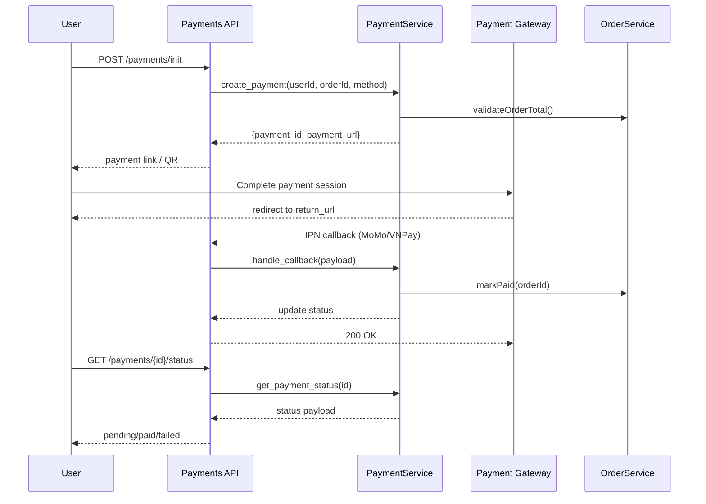
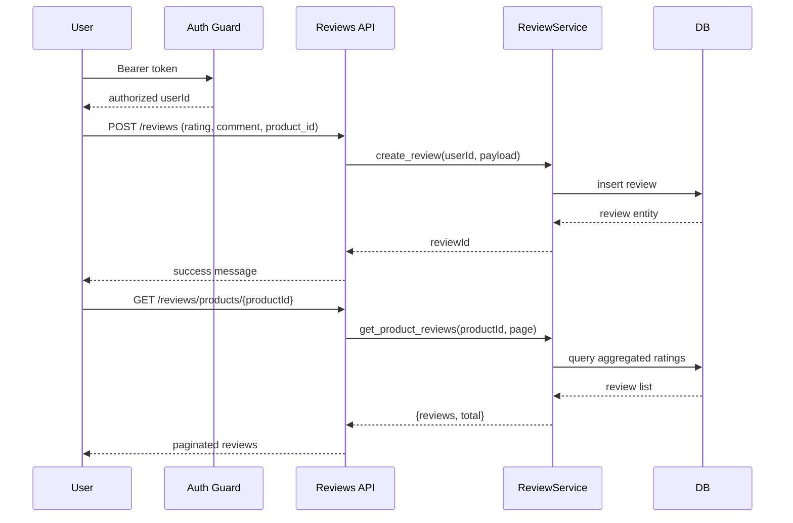
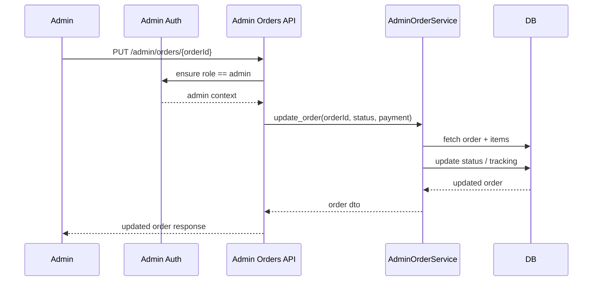
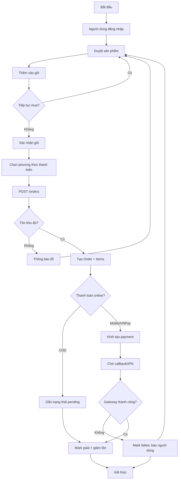
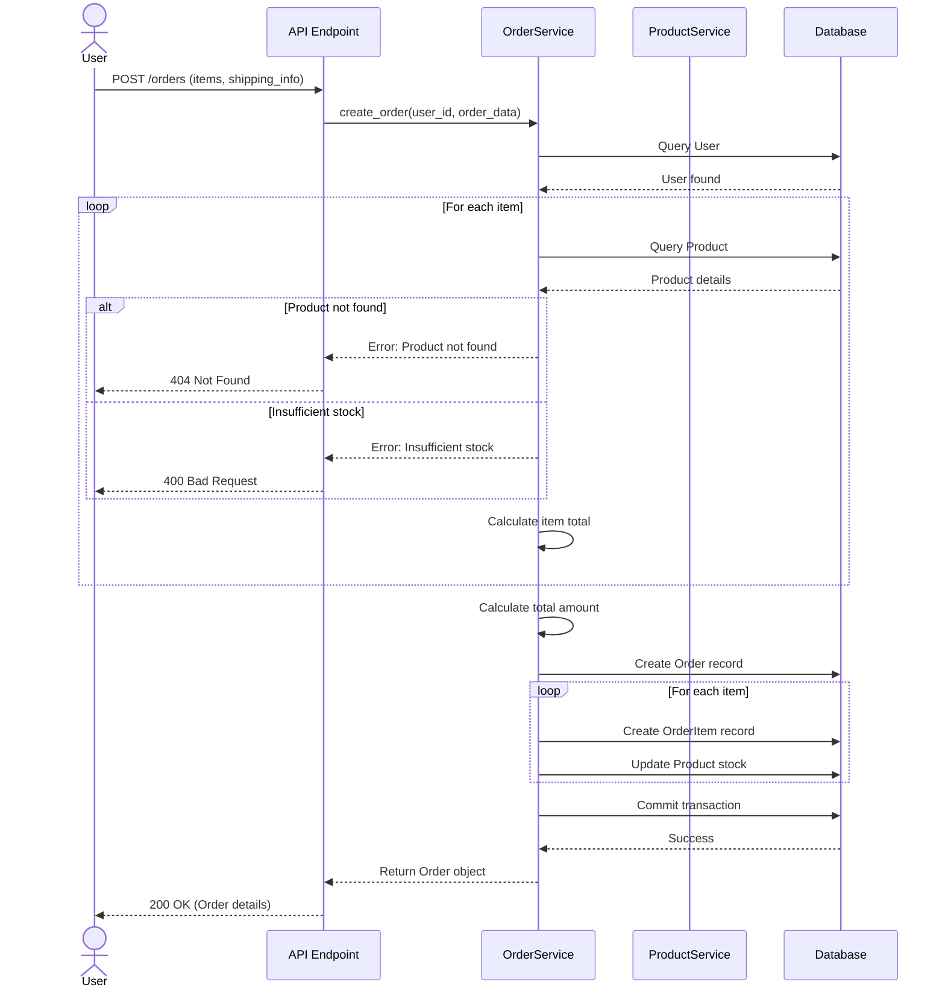
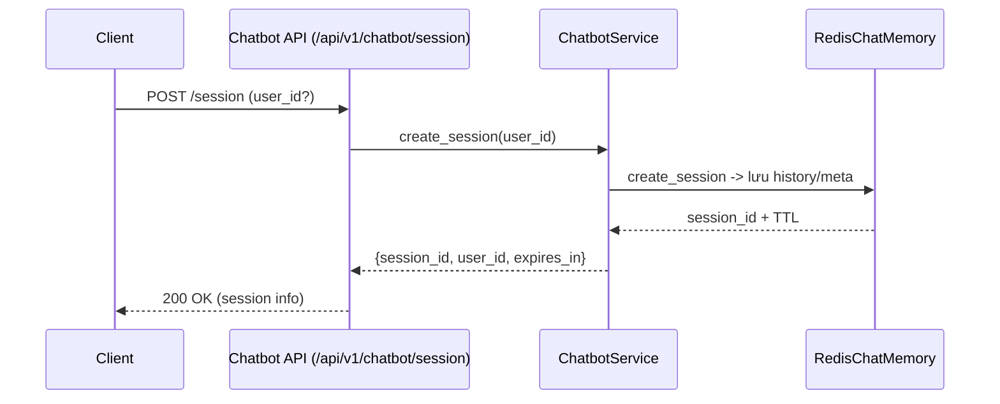
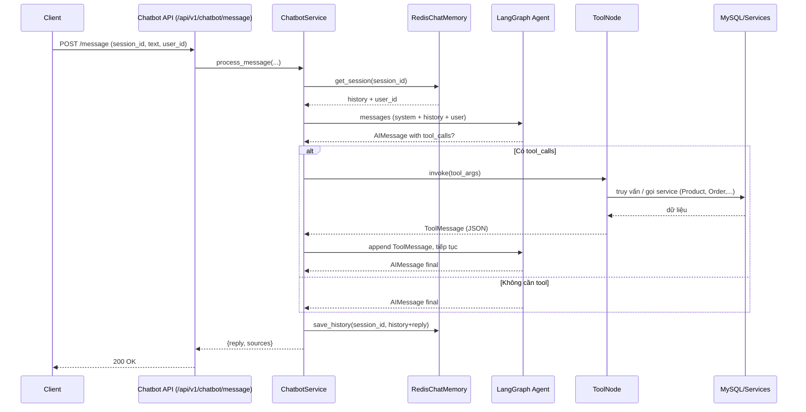
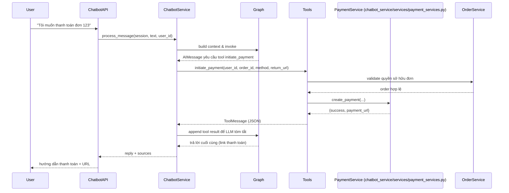

# System Design Notes

## Sequence Diagrams

### 1. Thanh toán 

### 2. Review sanr phẩm

### 3. Admin update thông tin order

## Activity Diagrams

### A1. Quy trình tạo đơn & thanh toán

## 4. Flow tạo order

## Chatbot Service Sequence Diagrams

### C1. Khởi tạo phiên trò chuyện

### C2. Xử lý tin nhắn và gọi tool

### C3. Chatbot khởi tạo thanh toán đơn hàng

