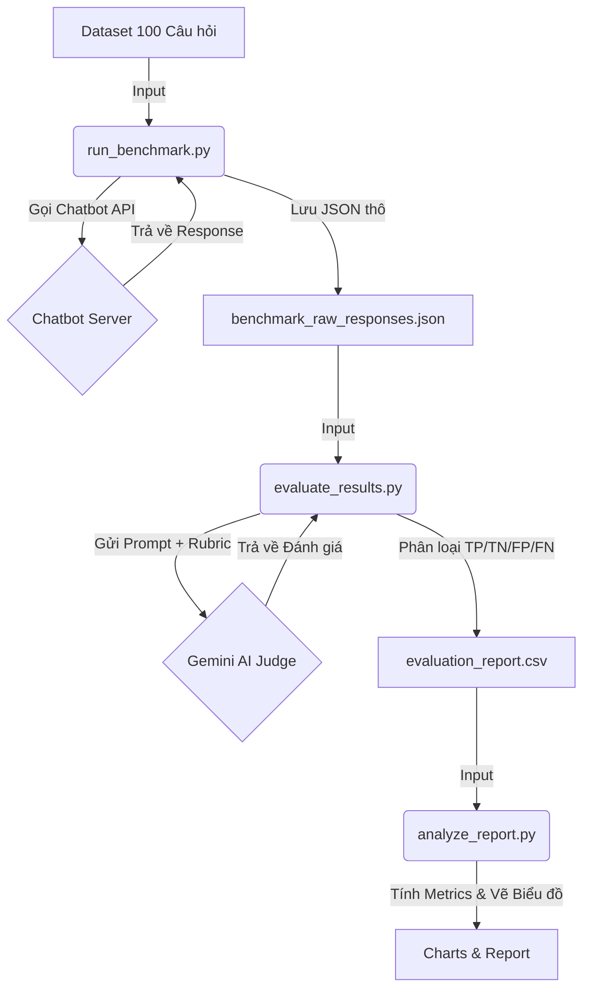

# Quy Trình Đánh Giá Tự Động Chatbot (Evaluation Pipeline)

Tài liệu này mô tả quy trình kỹ thuật để đánh giá hiệu năng của Chatbot dựa trên bộ testset 100 câu hỏi và AI Judge.

## 1. Sơ đồ quy trình (Workflow)



## 2. Chi tiết các bước

### Bước 1: Chuẩ bị dnữ liệu (Data Preparation)
- **Input**: File `dataset_fixed_100.csv`.
- **Cấu trúc**:
  - `id`: Định danh.
  - `query`: Câu hỏi của người dùng.
  - `expected`: Câu trả lời kỳ vọng (Ground Truth).
  - `gold`: Loại câu hỏi (`ANSWER` = cần trả lời, `REFUSE` = cần từ chối).

### Bước 2: Thực thi Benchmark (Execution)
- **Script**: `run_benchmark.py`
- **Chức năng**:
  - Gửi đồng thời (Async) 100 câu hỏi đến API Chatbot (`POST /api/v1/chatbot/message`).
  - Ghi nhận câu trả lời (`reply`), ngữ cảnh (`context`) và thời gian phản hồi (`latency`).
- **Output**: `evaluation_data/benchmark_raw_responses.json`.

### Bước 3: Chấm điểm tự động (AI Judging)
- **Script**: `evaluate_results.py`
- **Cơ chế**: Sử dụng mô hình **Gemini-1.5-flash** đóng vai trò là Giám khảo.
- **Rubric (Quy tắc chấm)**:
  - So sánh `Chatbot Response` với `Expected`.
  - Phân loại kết quả thành:
    - **Correct Answer**: Đúng.
    - **Missed / Fallback**: Không trả lời được.
    - **Hallucination**: Bịa đặt thông tin.
    - **Correct Refusal**: Từ chối đúng (với câu hỏi sai phạm).
- **Classification Logic**:
  - **TP (True Positive)**: Gold=ANSWER + Correct.
  - **FN (False Negative)**: Gold=ANSWER + Missed.
  - **FP (False Positive)**: Hallucination.
  - **TN (True Negative)**: Gold=REFUSE + Correct Refusal.
- **Output**: `evaluation_data/evaluation_report.csv`.

### Bước 4: Phân tích & Báo cáo (Analysis)
- **Script**: `analyze_report.py`
- **Chức năng**:
  - Đọc file CSV báo cáo.
  - Tính toán các chỉ số: **Accuracy**, **Precision**, **Recall**, **F1 Score**.
  - Vẽ biểu đồ phân phối (Confusion Matrix).
- **Output**: Thư mục `evaluation_data/charts/`.

## 3. Hướng dẫn chạy lại đánh giá (Re-run)

Nếu bạn cập nhật Chatbot (ví dụ: đổi Prompt, cập nhật DB) và muốn đánh giá lại, hãy chạy lần lượt các lệnh sau:

```bash
# 1. Chạy Benchmark (Tạo lại responses mới)
python run_benchmark.py

# 2. Chạy AI Judge (Chấm điểm lại)
python evaluate_results.py

# 3. Xem báo cáo & Biểu đồ mới
python analyze_report.py
```

## 4. Kết cấu thư mục

```
evaluation_data/
├── benchmark_raw_responses.json  # Dữ liệu response thô từ chatbot
├── evaluation_report.csv         # Bảng kết quả chấm điểm chi tiết
├── 3_8_Evaluation_Report.md      # Báo cáo tổng hợp dạng văn bản
├── charts/                       # Biểu đồ trực quan
│   ├── classification_dist.png
│   ├── detailed_assessment.png
│   └── success_rate_pie.png
└── EVALUATION_PROCESS.md         # (File này)
```
